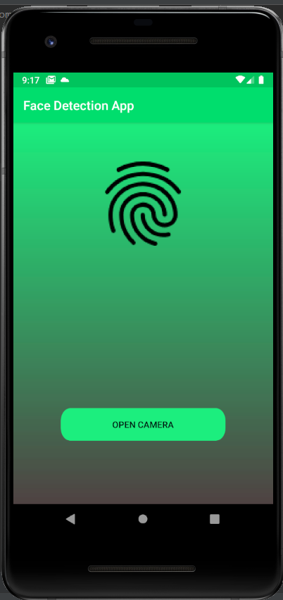
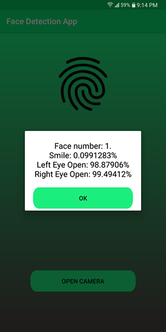

### Hi there, I'm Rafia Rahman Chowdhury, just another software developer. :smiley:

[Check Out My Resume](https://drive.google.com/file/d/1Hx47PGV34Q9iHfEYZje7WehO9reYpD01/view?usp=sharing)

### Connect with me:

<!-- [][website] -->
[][linkedin] 
[][instagram]
[][facebook] 
[][twitter]

 

### Languages and Tools:

 
 

## Recent GitHub Acitivity
---

## Recent Projects:

---

### Covid-19 Tracker
 It is an android application that shows worldwide as well as country wise covid-19 cases
### Github Repository: Covid-19 Tracker
## Project Features:

* Search Functionality so that a user can search cases by country.
* Pie Chart 
* Time and Date   

 ### Libraries/Languages/Platform/SDK:  Java, Volley, Glide, Eaze Graph and 
CircularImageView.

 

#### Project Link:
[Repository](https://github.com/RafiaChy/Covid-19-Tracker)

### Machine Learning Face and Smile Detection App
 It is an android application uses MLKIT in Firebase
 Github Repository: Face Detector
Project Features:

* Gives the percentage of left eye open
* Give the percentage of right eye open
* Gives the percentage of smile
     
Libraries/Languages/Platform/SDK:Java, MLKIT, Firebase

 

#### Project Link:
[Repository](https://github.com/RafiaChy/Machine-Learning-Face-and-Smile-Detection)

### Weather Application
 It is an android application Java
 Github Repository: Weather App
Project Features:
	
* Gives temperature as well as ‘feels-like’ in Celsius
	
* Give humidity
	
* Gives the counts of clouds
	
* Gives wind speed
     
Libraries/Languages/Platform/API/SDK:  Java, Retrofit, OpenWeatherMap

#### Project Link:
[Repository](https://github.com/RafiaChy/Get-Weather-Updates)

 
[Resume]:https://drive.google.com/file/d/1hYIo3oQ0xvx_MZXBcT3yRqSKFBbQw8rL/view?usp=sharing
[facebook]: http://www.facebook.com/profile.php?id=100010895778309
[instagram]: http://www.instagram.com/rafia_chy
[linkedin]: https://www.linkedin.com/in/rafia-chowdhury-056346a9/ 
[twitter]: https://twitter.com/RafiaRahmanCho1

